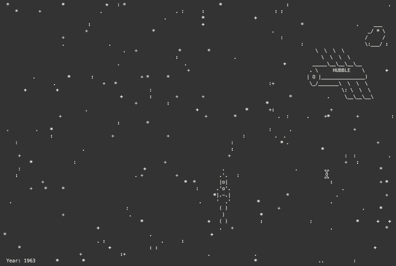

# Space garbage

This is a small console game where you control a spaceship and destroy space garbage.

## Gameplay

## Idea
It's based on an idea from [this video](https://www.youtube.com/watch?v=i8U8rmeCnXw) — just have a look at how the near-the-Earth space has been contaminated over the last 60 years.

The speed of the game and all events are tied to years. One year is equal to 1.5 seconds of game time.
The time countdown starts in 1957, the year when the first artificial satellite was launched. Until 1961 the space is clean and empty, then the garbage appears.
Over time, more and more of it appears and by 2020, the ship is armed with a plasma cannon to clear its way.

## Game control

Use the arrow keys to move the spaceship around. Press the space bar to shoot.

## How to run the game

1. First, you need to clone the repo:  
    `git clone git@github.com:gaisin/space_garbage.git`
2. Create vitual environment inside cloned directory and activate it:  
    `cd space_garbage`  
    `python3 -m venv .venv`  
    `source .venv/bin/activate`  
2. Then install the game to your virtual environment with pip and launch it:  
    `pip install -e .`  
    `play-space-garbage`
